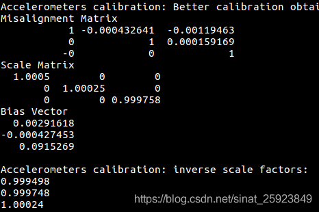
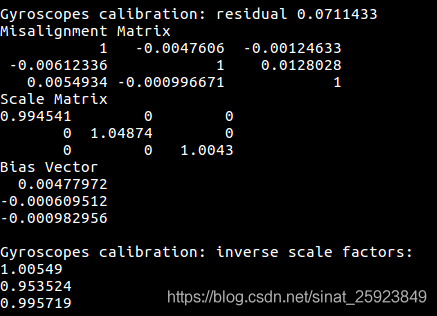
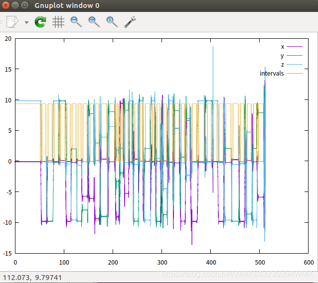

# IMU-TK

This is a ROS wrapper for imu_tk, learn details from original [README.md](./README_original.md) please.

## Install

```sql
sudo add-apt-repository ppa:rock-core/qt4
sudo apt update

sudo apt install PACKAGE_NAME

# remove 
sudo add-apt-repository --remove ppa:rock-core/qt4

# 安装依赖
sudo apt-get install build-essential cmake libeigen3-dev libqt4-dev libqt4-opengl-dev freeglut3-dev gnuplot

```

## Build

Place this package inside your catkin workspace (e.g. `~/catkin_ws/src`), then build it through `catkin_make`.

```Bash
cd ~/catkin_ws
catkin_make
rospack profile
source devel/setup.bash
```

## Test

### Collect IMU Data

Record a bag file with IMU topic (e.g. `rosbag record -O imu /imu`).

Procedure:

1. Left the IMU static for 50 seconds.
2. Rotate the IMU and then lay it in a different attitude.
3. Wait for at least 1 seconds.
4. Have you rotated the IMU 36 ~ 50 times? If not, go back to step 2.
5. Done.

### Calibration

Run `imu_calib_node` to get calibration result(e.g. misalignment, scale and bias).

`imu_calib_node` usage: 

> rosrun imu_tk imu_calib_node [BAG] [IMU_TOPIC]

```Bash
rosrun imu_tk imu_calib_node imu.bag /imu
```

原生的imu_tk是纯c++版本的 [1] ，后来有高手贡献了一个ROS的版本 [2]，如果使用原生版本，需要将imu的数据转成mat文件，我们这里以ROS版本为例记录步骤。
录制bag数据，录制的基本步骤见imu_utils的使用流程1～2，这里录制的要求按照一个流程来：
- Left the IMU static for 50 seconds.

- Rotate the IMU and then lay it in a different attitude.

- Wait for at least 1 seconds.

- Have you rotated the IMU 36 ~ 50 times ? If not, go back to step 2.

- Done
  这就个步骤简单小结就是先静止50秒，然后拿起来转一下，停一下，再转一下，停一下，转的方向随意，停的时候尽量停稳个1~2秒，大概重复几十次就可以，没什么特别的要求。
  使用ros版本的imu_tk的节点来计算misalignment，scale和bias，命令为$ rosrun imu_tk imu_calib_node xx.bag /imu该命令的参数是bag名称和topic名称rosrun imu_tk imu_calib_node [BAG] [IMU_TOPIC]
  最后，根据上述步骤，利用手头的Xsens的IMU标定了一波，参数如图所示。

- **加速度计的确定性误差**

  

- **陀螺仪的确定性误差**

  


### 矫正过程：

Given a raw sensor reading X (e.g., the acceleration ), the calibrated "unbiased" reading X' is obtained.

```Txt
Misalignment matrix:

    [    1     -mis_yz   mis_zy  ]
T = [  mis_xz     1     -mis_zx  ]
    [ -mis_xy   mis_yx     1     ]

Scale matrix:

    [  s_x      0        0  ]
K = [   0      s_y       0  ]
    [   0       0       s_z ]

Bias vector:

    [ b_x ]
B = [ b_y ]
    [ b_z ]

X' = T*K*(X - B)
```




# imu误差分析

IMU需要标定的参数主要是确定性误差（系统误差）和随机误差。
确定性误差主要标定bias（零偏误差），scale（刻度系数误差，标度因数）和misalignment（安装误差，小量）；
随机误差主要标定bias instability（零偏不稳定性误差：会使陀螺仪和加速度计的零偏随时间慢慢变化，逐渐偏离开机时校准的零偏误差，同时还会造成一部分随机行走误差的效果；另一种说法是它表示在一段时间内零偏bias的变化量）和random walk（陀螺仪与加速度计的随机游走误差，又叫：传感器的高斯白噪声，详细解释为：陀螺仪测量的角速度，加速度计测量的加速度的噪声是高斯白噪声）。
【注】：
1、一般文献中的 IMU 随机误差模型是高斯白噪声和维纳过程的叠加，IMU 的随机误差的参数可以通过艾伦方法测量。在卡尔曼滤波器中，我们需要使用 IMU 的误差模型来计算状态变量的方差随时间的变化。
2、下面第3点，归为随机误差里的bias，另外还有random walk，这是两类噪声。
3、针对零偏bias（又称：零偏的重复性），每次IMU上电会产生较大的误差，这个一般在自己的代码中，用融合的方法（在滤波或者融合的过程中）去实时的估这个bias值。另外需要额外指出的是：此时的总bias = 零偏重复性产生的 bias值+ bias instability（零偏不稳定性误差，不确定性零偏）。
【后注】：
1、针对确定性误差（bias（零偏误差），scale（刻度系数误差，标度因数）和misalignment（安装误差，小量）），在陀螺出厂前会进行调零操作，避免陀螺输出参数存在此误差对后续算法精度产生影响。
2、理论上，采数据时的陀螺只存在bias instability（零偏不稳定性误差，不确定性零偏）和 random walk（陀螺仪与加速度计的随机游走误差），这两个参数在组合导航中都是要实时估计的。
参考大佬：
1、4.1 IMU误差模型
2、VIO标定IMU随机误差：Allan方差法
3、IMU标定（二）随机误差的标定
4、IMU标定（三）确定误差的标定

